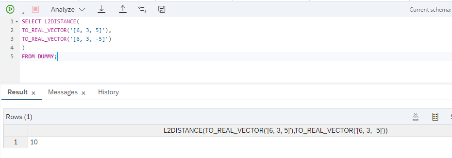
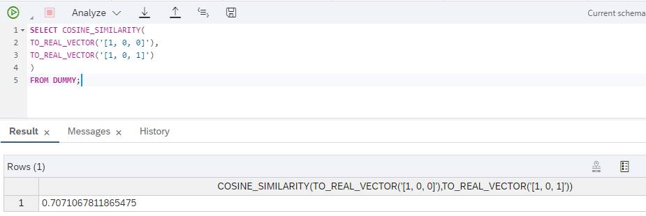
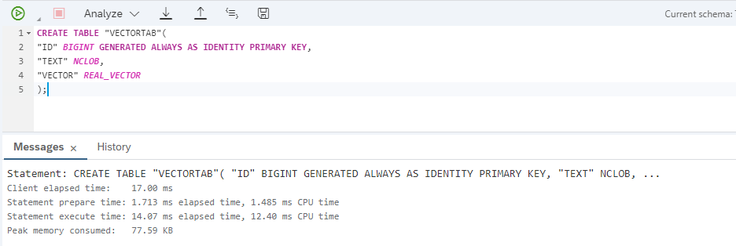
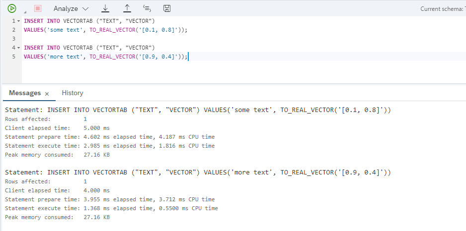
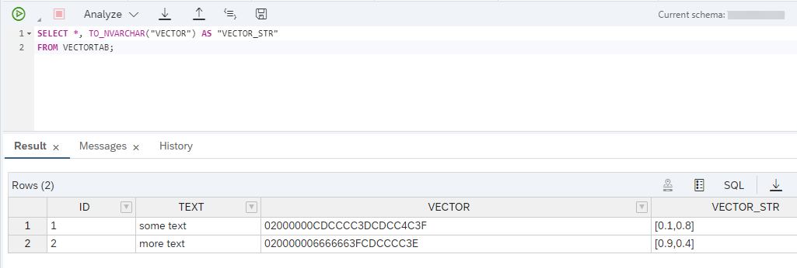
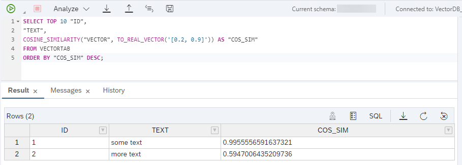
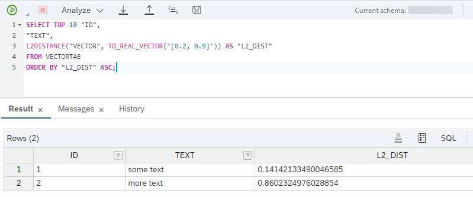
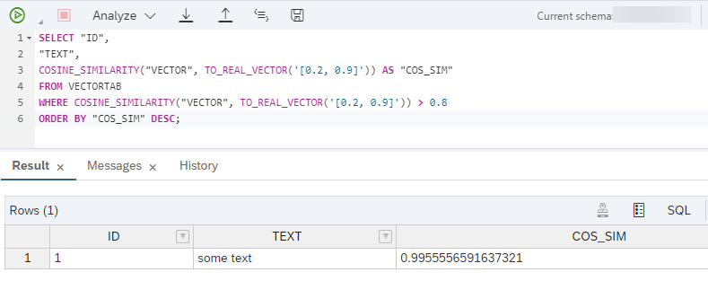
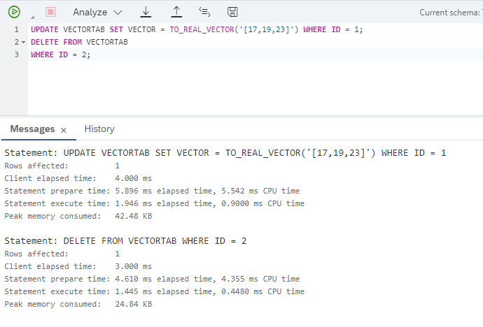
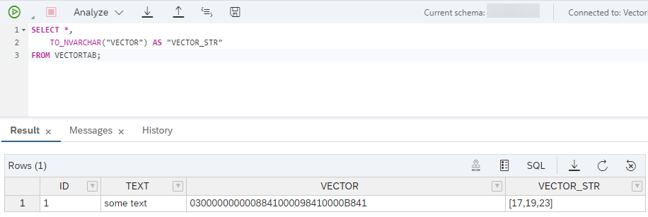

# Introduction to SAP HANA Cloud Vector engine

Leverage SAP HANA Cloud vector engine to create, read, update, and delete (CRUD) operations involving vectors using SQL. The ability to determine similarity among vectors enables developers to enhance intelligent data applications with naturally intuitive use cases such as the following:


## Prerequisites

- This tutorial is designed for SAP HANA Cloud. It is not designed for SAP HANA on premise or SAP HANA, express edition.
- You have registered for SAP HANA Cloud instance. [Register SAP HANA Cloud basic trial]([hana-cloud-basic-trial](https://www.sap.com/uk/products/technology-platform/hana/trial.html))
<!-- - You have setup SAP Business Application Studio for development: [Set Up SAP Business Application Studio for Development](appstudio-onboarding) -->

## You will learn

- How to use the SQL Cosine Similarity Vector Function
- How to use the SQL L2 Distance Vector Function


### Vectors, Vector Embeddings, and Similarity Functions

The purpose of a database using vectors, vector embeddings and similarity functions is to evaluate the similarity of two objects.

**Vectors** are geometric objects that have a direction and a length. Vectors can be numerically represented by a sequence of elements, such as [2, 3, 5]. The number of elements contained in a vector is referred to as its *dimension*.

**Vector embeddings** are vectors that are generated by embedding models. Embedding models are neural networks designed to map objects to vectors. The type of objects that can be mapped, along with the manner in which these objects are vectorized, depends on the specific embedding model used. Common object types that can be embedded include words, text snippets, and images. The goal of an embedding model is to map similar objects to similar vectors.

While it is usually hard and computationally expensive to determine the similarity of two objects, it is easy and computationally cheap to assess the similarity between two arrays of numbers or vectors. A **similarity function** is a mathematical function that maps two vectors to a single number. Popular similarity functions are the *L2 distance*, which describes the distance of the vectors in Euclidean space, and *Cosine Similarity* describing the similarity in vector direction.

These functions are included as part of SAP HANA Cloud's library of *Vector Functions*.

<!-- </br> -->

<!-- ### Cosine Similarity Vector Function

**SQL Syntax:** 

```SQL
COSINE_SIMILARITY(<vector1>, <vector2>)
```

Cosine similarity measures the cosine of the angle between two vectors - providing an indication of the similarity between objects represented by vectors. Note that both vectors must have the same dimension.
The result is the same regardless of function - a DOUBLE number between -1 (exactly opposite) and 1 (exactly equal). The greater the result, the more similar are the vectors.


### L2 Distance Vector Function

**SQL Syntax:** 
```SQL 
L2DISTANCE(<vector1>, <vector2>)
```

*L2DISTANCE* calculates the straight line distance between *vector1* and *vector2* in Euclidean space. This determination is useful in various scenarios such as clustering, outlier detection, and spatial data analysis. Both vectors must have the same number of dimensions.
The result is a DOUBLE number greater or equal to 0. The greater the result, the greater the dissimilarity due to the distance between the vectors. The smaller the result, the more similar they are.

</n>

------
### Try it out! -->


<!-- This tutorial delves into the usage of the SAP HANA Cloud vector engine functions *L2DISTANCE* and *COSINE_SIMILARITY*. It also demonstrates how to incorporate the *TO_REAL_VECTOR* and *TO_NVARCHAR* functions in SQL queries within the SAP HANA Cloud environment. -->

<!-- >**Note:** The given examples use the *DUMMY* table which is a special system table designed for scenarios where a query requires an empty table.
</n> -->

### L2DISTANCE Function

L2DISTANCE is most commonly used when the actual distance between two points or vectors is required. This function is particularly useful for algorithms that rely on the physical distance between two points, like k-nearest neighbors (KNN) or k-means clustering.

<!-- **SQL Example with L2DISTANCE** -->

1. Copy the following SQL query and run it in Database Explorer:

    ```sql
    SELECT L2DISTANCE(
    TO_REAL_VECTOR('[6, 3, 5]'),
    TO_REAL_VECTOR('[6, 3, -5]')
    )
    FROM DUMMY;
    ```




A Euclidean distance of 10 units between the vectors signifies the length or magnitude of the straight line connecting these two points in three-dimensional space.

In practical terms, this distance represents how far apart these vectors are from each other. The larger the Euclidean distance, the farther apart the vectors are in the given space.

### COSINE_SIMILARITY Function

COSINE_SIMILARITY is used to determine how alike two vectors might be using the difference in direction. The comparison approach of this function is widely used in text analysis, where the magnitude of the vector might not be as relevant.

<!-- **SQL Example with COSINE_SIMILARITY** -->

The query below calculates the similarity between two vectors in terms of their orientation in space - irrespective of their magnitude. The result of the cosine similarity function approaching 1 indicates that the shared angle is smaller and thus the vectors are more potentially alike than other vectors.

1. Copy the following SQL query and run it in Database Explorer:

    ```sql
    SELECT COSINE_SIMILARITY(
    TO_REAL_VECTOR('[1, 0, 0]'),
    TO_REAL_VECTOR('[1, 0, 1]')
    )
    FROM DUMMY;
    ```
    
    

This query will return the cosine similarity between the vectors [1, 0, 0] and [1, 0, 1].
Given that these vectors are not pointing in the exact same direction, as well as not orthogonal, the cosine similarity will be between 0 and 1.
Specifically, since the vectors share the same x-component and their y-components and z-components are not entirely dissimilar, the cosine similarity indicates a moderate level of similarity.


### REAL_VECTOR Data Type

SAP HANA Cloud uses the built-in vector data type *REAL_VECTOR*.
This data type consists of REAL elements (IEEE 754 single-precision floating-point) and the number of dimensions in a REAL_VECTOR column can range from 1 to 65,000.

The **REAL_VECTOR** data type can be used like any other SAP HANA SQL data type, but it has some limitations that are similar to the limitations of LOB (BLOB and NCLOB) data types:

- There is no order defined on REAL_VECTOR. All operations relying on ordering, such as grouping, ordering, etc. can't be used on vectors.
- REAL_VECTOR cannot be used in an arithmetic expression. For example, it's not possible to add vectors.
- REAL_VECTOR doesn't support parquet files for data import and data export.
- REAL_VECTOR columns are not supported in row tables, cannot be used as partitioning key for table partitioning and are not supported for use in SAP HANA Native Storage Extension (NSE).

Tables with REAL_VECTOR columns are created just like regular tables using the CREATE statement. Optional constraints can be defined on the vector columns when the table is created, such as dimension.

1. The following example creates a table called **VECTORTAB** with a vector column.The vector column accepts vectors with any dimensions:

    ```sql
    CREATE TABLE "VECTORTAB"(
    "ID" BIGINT GENERATED ALWAYS AS IDENTITY PRIMARY KEY,
    "TEXT" NCLOB,
    "VECTOR" REAL_VECTOR
    );
    ```
    
    


### Inserting, Updating and Deleting Vectors

Vectors are loaded into the database using the INSERT statement. 

>**Note:** There are no implicit conversions to REAL_VECTOR and a vector must be constructed first, as described in this guide on [Constructing and Serializing Vectors](https://help.sap.com/docs/hana-cloud-database/sap-hana-cloud-sap-hana-database-vector-engine-guide/constructing-and-serializing-vectors), before it can be inserted.

1. The following example inserts two vectors into the **VECTORTAB** table:

    ```sql
    INSERT INTO VECTORTAB ("TEXT", "VECTOR")
    VALUES('some text', TO_REAL_VECTOR('[0.1, 0.8]'));

    INSERT INTO VECTORTAB ("TEXT", "VECTOR")
    VALUES('more text', TO_REAL_VECTOR('[0.9, 0.4]'));
    ```
    
    

2. Inspect the table data with the following query:

    ```sql
    SELECT *, TO_NVARCHAR("VECTOR") AS "VECTOR_STR"
    FROM VECTORTAB;
    ```

    


3. Find the similarity between some new text, and one of the text representations in the table.

If this "new text" is represented in vector form as [0.2, 0.9], the following query will compare it with other vectors in the table using **Cosine Similarity**:

    ```sql
    SELECT TOP 10 "ID",
    "TEXT",
    COSINE_SIMILARITY("VECTOR", TO_REAL_VECTOR('[0.2, 0.9]')) AS "COS_SIM"
    FROM VECTORTAB
    ORDER BY "COS_SIM" DESC;
    ```

    

The given vector is compared to the vectors in the table and the similarity is calculated. As can be seen from the result, one vector is quite similar (0.99) while the other is not (0.59).

4. Now use **L2DISTANCE** to calculate the distance between a given vector and vector in the table [0.2, 0.9] => [0.1, 0.8]


    ```sql
    SELECT TOP 10 "ID",
    "TEXT",
    L2DISTANCE("VECTOR", TO_REAL_VECTOR('[0.2, 0.9]')) AS "L2_DIST"
    FROM VECTORTAB
    ORDER BY "L2_DIST" ASC;
    ```

    

5. It's also possible to filter with the WHERE clause of an SQL query using vectors. The following example only returns rows when the result of a cosine similarity search is greater than 0.8:

    ```sql
    SELECT "ID",
    "TEXT",
    COSINE_SIMILARITY("VECTOR", TO_REAL_VECTOR('[0.2, 0.9]')) AS "COS_SIM"
    FROM VECTORTAB
    WHERE COSINE_SIMILARITY("VECTOR", TO_REAL_VECTOR('[0.2, 0.9]')) > 0.8
    ORDER BY "COS_SIM" DESC;
    ```

    

6. Vectors can be updated and deleted like any other data type using the UPDATE and DELETE SQL statements.
The following commands update the vector with ID 1 and delete the vector with ID 2:

    ```sql
    UPDATE VECTORTAB SET VECTOR = TO_REAL_VECTOR('[17,19,23]') WHERE ID = 1;
    DELETE FROM VECTORTAB
    WHERE ID = 2;
    ```

    

7. Inspect the **VECTORTAB** table and observe the results of the above queries:

    ```sql
    SELECT *,
        TO_NVARCHAR("VECTOR") AS "VECTOR_STR"
    FROM VECTORTAB;
    ```

    


This tutorial discussed the benefits of vectors as well as providing a hands-on SQL tutorial to the SAP HANA Cloud vector engine.
